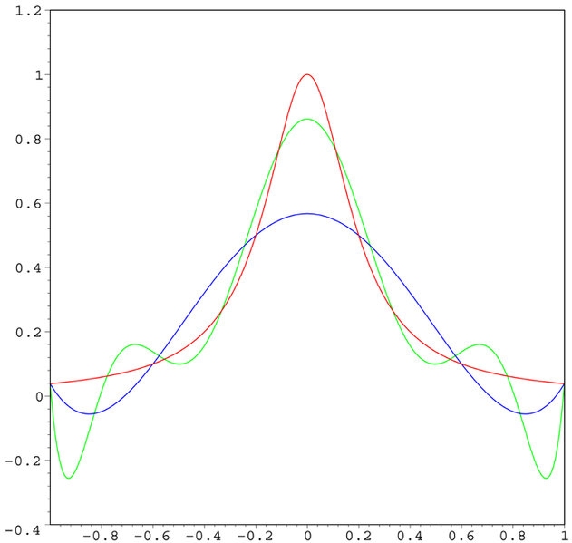
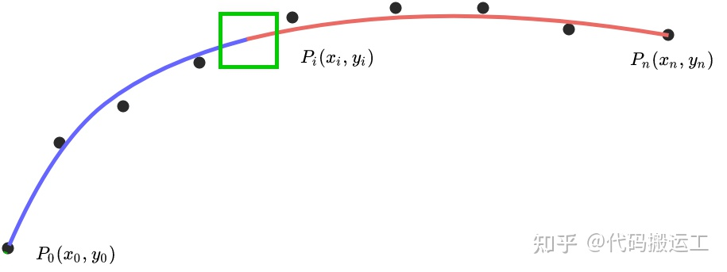
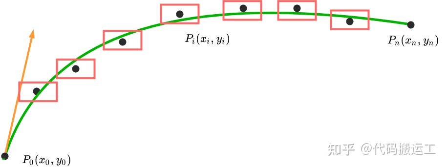
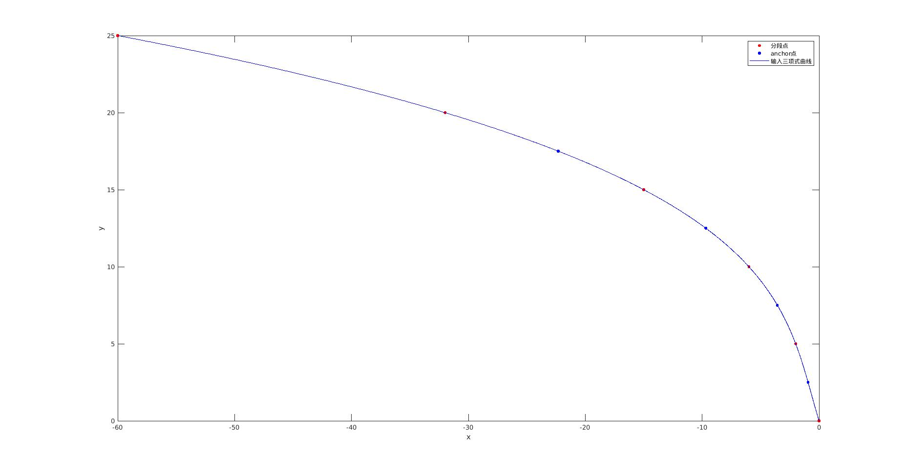
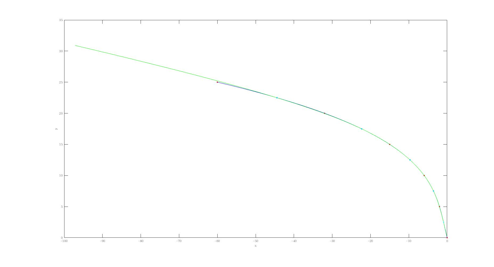
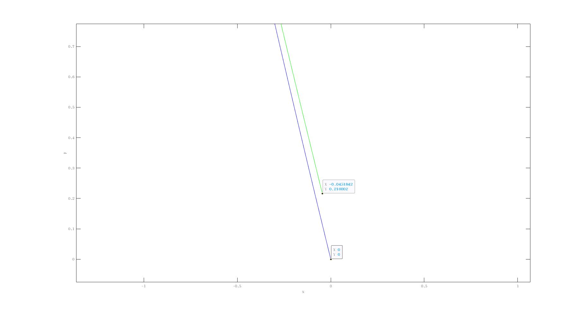
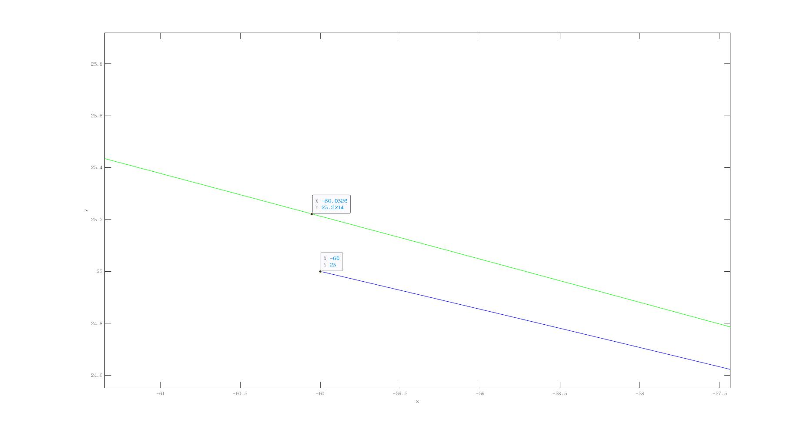
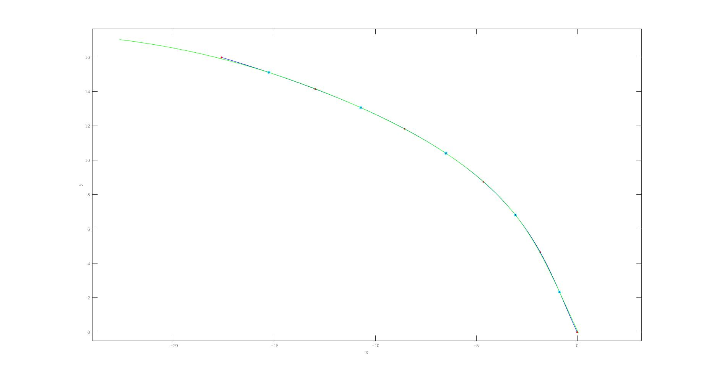
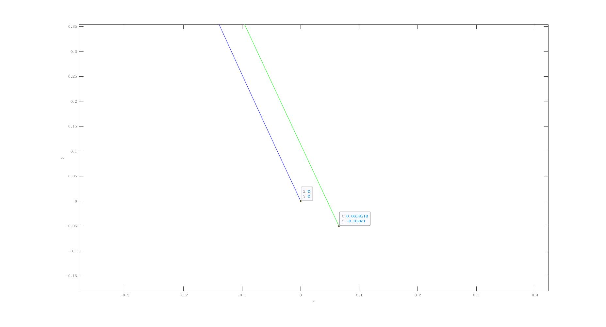
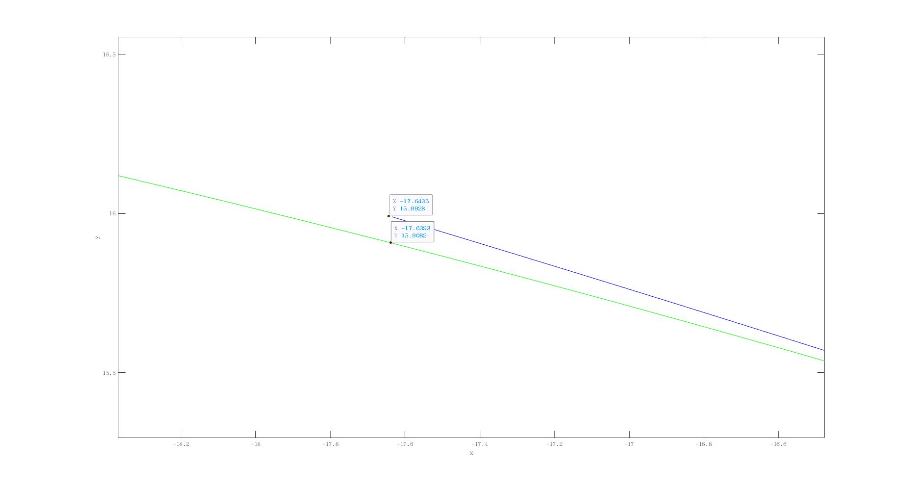

# path planning-5次Spline样条曲线光滑算法Demo
[TOC]

## 基础知识

### [非参数化曲线缺点](https://blog.csdn.net/Jurbo/article/details/75046766)
1. 与坐标轴有关.
2. 用显式函数表示会存在多值性.
3. 用隐式函数表示不直观,作图不方便.
4. 会出现斜率为无穷大的情形.

### 五次样条曲线(quintic spline)的应用:
1. 五次的原因:车辆输入为加速度a(油门),a的加速度jerk对应于a的平滑性,正对应位置的五次微分.
2. 样条曲线的优点:相对而言较为简单,待补充.
3. 样条曲线的缺点:容易出现[龙格现象](https://zh.wikipedia.org/wiki/%E9%BE%99%E6%A0%BC%E7%8E%B0%E8%B1%A1),如下图
4. 分段求解的原因:对于比较极端的曲线(例:直角弯,U型弯)一条多项式曲线已经不足以精确描述曲线的形状.
5. 输入:为多项式曲线的采样点(基于自车坐标系,见下图的右手系)$x=c_0+c_1y+c_2y^2+c_3y_3^3$,即,$x=\vec{C}T(y)$,$T(s)$为对$s$的多项式矩阵(mobileye的车道线输入为三次多项式).对于离散点输入,Apollo在相同位置有类似的算法,后面有机会可以介绍.
6. 输入曲线采样:
参照百度Apollo里的代码可知,输入的ReferenceLine先是分段为knot,后又细分成anchor_point(实际上是先有的anchor point再有的knot,在这个算法里顺序是反的).默认的配置文件表明前者的采样间距为25m,后者的为5m.至于为什么按照这个方法采样,先按下不表,后面详细解释.
Apollo代码演示采样分段,[来源](https://github.com/xinchu911/Apollo-Note/tree/master/docs/planning).
先对输入ReferenceLine进行AnchorPoints采样,同时初始化bounding box的约束.
 ```c++
/// file in apollo/modules/planning/reference_line/reference_line_provider.cc
void ReferenceLineProvider::GetAnchorPoints(const ReferenceLine &reference_line,
    						std::vector<AnchorPoint> *anchor_points) const {
  // interval为采样间隔，默认max_constraint_interval=5.0，即路径累积距离每5m采样一个点。
  const double interval = smoother_config_.max_constraint_interval();
  // 路径采样点数量计算
  int num_of_anchors = std::max(2, static_cast<int>(reference_line.Length() / interval + 0.5));
  std::vector<double> anchor_s;
  // uniform_slice函数就是对[0.0, reference_line.Length()]区间等间隔采样，每两个点之间距离为(length_-0.0)/(num_of_anchors - 1)
  common::util::uniform_slice(0.0, reference_line.Length(), num_of_anchors - 1, &anchor_s);
  // 根据每个采样点的累积距离s，以及Path的lane_segments_to_next_point_进行平滑插值，得到累积距离为s的采样点的坐标(x,y)，并进行轨迹点矫正
  for (const double s : anchor_s) {
    anchor_points->emplace_back(GetAnchorPoint(reference_line, s));
  }
  anchor_points->front().longitudinal_bound = 1e-6;
  anchor_points->front().lateral_bound = 1e-6;
  anchor_points->front().enforced = true;
  anchor_points->back().longitudinal_bound = 1e-6;
  anchor_points->back().lateral_bound = 1e-6;
  anchor_points->back().enforced = true;
}
 ```
再进行分段t_knots_.
 ```c++
uint32_t num_spline = std::max(1u, static_cast<uint32_t>(length / config_.qp_spline().max_spline_length() + 0.5));
for (std::uint32_t i = 0; i <= num_spline; ++i) {
  t_knots_.push_back(i * 1.0);
}
 ```

刚开始不解Apollo的这种分段做法,先从简单的设定开始.我决定在自车坐标系坐标轴等距采样,即沿着自车行进方(+y轴)采样,得点列($x_{ref_i},y_{ref_i}$)
此方法的问题在于,一个是不准,二个是在U-turn等场景下可能会出现采样多值的问题.可以考虑通过Dubin曲线筛选路径较短的那个值来解决.
![自车坐标系coordination_setting.png)
## 1.数学模型建立

### 1.QP标准形式
$$
\begin{aligned}
minimize  & \frac{1}{2}  \cdot x^T \cdot H \cdot x  + f^T \cdot x \\
s.t. \qquad & LB \leq x \leq UB \\
      & A_{eq}x = b_{eq} \\
      & Ax \geq b
\end{aligned}
$$
(注:其中等式约束可以化成两个不等式约束用osqp求解)
### 2.输入定义

* **输入采样后的离散点列${P_i}$**
$$(x_{refi},y_{refi}) \qquad i=1 \cdots n$$

* **路径方程**
$P_i$总共$n$个点,$n-1$个路径段.可得$i$段的$x$与$y$的关于$t$的参数方程(后面只列$x(t)$的求解过程,$y(t)$类似).对每段曲线自变量归一化$t \in [0,1]$,后面用$t_{io}$与$t_{i1}$分别表示每段曲线的起止点.
$$x_i(t)=a_{i0}+a_{i1} \times t+a_{i2} \times t^2+a_{i3} \times t^3+a_{i4} \times t^4+a_{i5} \times t^5\\
y_i(t)=b_{i0}+b_{i1} \times t+b_{i2} \times t^2+b_{i3} \times t^3+b_{i4} \times b^4+b_{i5} \times t^5$$

* **优化变量**
使用$\vec{a_i}$表示第$i$段$x_i(t)$多项式系数向量:
$$\vec{a_i}=\begin{bmatrix}
    a_{i0} & a_{i1} & a_{i2} & a_{i3} & a_{i4} & a_{i5}
\end{bmatrix}$$
使用$\vec{b_i}$表示第$i$段$y_i(t)$多项式系数向量:
$$\vec{b_i}=\begin{bmatrix}
    b_{i0} & b_{i1} & b_{i2} & b_{i3} & b_{i4} & b_{i5}
\end{bmatrix}$$
合并得:
$$ X_i = {[\vec{a_i} \quad \vec{b_i}]}^T$$

* **目标方程**
使用$x_i(t)$的三阶导的平方和近似为路径总长度(车辆操作不管油门还是方向盘都是加速度输入,即为三阶导,平方和为操作量的大小.对应的物理意义为尽量减少操作量,Least Energy.)
$$cost = \sum_{i=1}^n \bigg( \int^{t_{i1}}_{t_{i0}}({x_i}^{\prime\prime\prime})^2(t)dt + \int^{t_{i1}}_{t_{i0}} ({y_i}^{\prime\prime\prime})^2(t)dt\bigg)$$
对$x_i(t)$求各阶导:
$${x_i}^{\prime}(t)=\vec{a_i}\begin{vmatrix}
    0\\1\\{2t}\\{3t^2}\\{4t^3}\\{5t^4}
\end{vmatrix} = \vec{a_i} \cdot \vec{T^\prime(t)}$$
$${x_i}^{\prime\prime}(t)=\vec{a_i}\begin{vmatrix}
    0\\0\\2\\{6t}\\{12t^2}\\{20t^3}
\end{vmatrix} = \vec{a_i} \cdot \vec{T^{\prime\prime}(t)}$$
$${x_i}^{\prime\prime\prime}(t)=\vec{a_i}\begin{vmatrix}
    0\\0\\0\\6\\{24t}\\{60t^2}
\end{vmatrix} = \vec{a_i} \cdot \vec{T^{\prime\prime\prime}(t)}$$

    可得:
$$
\int\limits_{t_{i0}}^{t_{i1}}
({x_i}^{\prime\prime\prime})^2(t) dt = \vec{a_i} \int\limits_{t_{i0}}^{t_{i1}}(T^{'''}(t) \cdot T^{'''}(t)^T \cdot \vec{a_i}^T)dt \\ = \vec{a_i} \int \limits_{t_{i0}}^{t_{i1}} \Bigg(\begin{bmatrix}
    0 & 0 & 0 & 0 & 0 & 0\\
    0 & 0 & 0 & 0 & 0 & 0\\
    0 & 0 & 0 & 0 & 0 & 0\\
    0 & 0 & 0 & {36} & {144t} & {360t^2}\\
    0 & 0 & 0 & {144t} & {576t^2} & {1440t^3}\\
    0 & 0 & 0 & {360t^2} & {1440t^3} & {3600t^4}\\
\end{bmatrix}
\cdot \vec{a_i}^T \Bigg)dt \\=\vec{a_i}\begin{bmatrix}
    0 & 0 & 0 & 0 & 0 & 0\\
    0 & 0 & 0 & 0 & 0 & 0\\
    0 & 0 & 0 & 0 & 0 & 0\\
    0 & 0 & 0 & 36 & 72 & 120\\
    0 & 0 & 0 & 72 & 192 & 360\\
    0 & 0 & 0 & 120 & 360 & 720\\
\end{bmatrix}
\cdot \vec{a_i}^T
$$
    令:
$$ M = \begin{bmatrix}
    36 & 72 & 120\\
    72 & 192 & 360\\
    120 & 360 & 720\\
\end{bmatrix}$$

    因此在不考虑松弛变量下的$H$如下:
$$ cost= \sum_{i=1}^{n}(\vec{a_i}H_{ix}\vec{a_i}^T + \vec{b_i}H_{iy}\vec{b_i}^T) \\ = \sum_{i=1}^{n} (\vec{X_i}^T H_i \vec{X_i} )\\ = \vec{X}H\vec{X}^T$$

    其中,
$$H_i = 2\begin{bmatrix}
    0 & 0 & 0 & 0 & 0 & 0 & 0 & 0 & 0 & 0 & 0 & 0\\
    0 & &&&&\cdots &&&&&& 0\\
    0 & &&&&\cdots &&&&&& 0\\
    0 & 0 &0 &36 & 72 & 120 &&&\cdots &&&0\\
    0 & 0 &0 &72 & 192 & 360&&&\cdots &&&0\\
    0 & 0 &0 &120 & 360 & 720 &&&\cdots &&&0\\0 & &&&&\cdots &&&&&& 0\\
    0 & &&&&\cdots &&&&&& 0\\
    0 & &&&&\cdots &&&&&& 0\\
    0 & &&&&\cdots &&&& 36 & 72 & 120\\
    0 & &&&&\cdots &&&& 72 & 192 & 360\\
    0 & &&&&\cdots &&&& 120 & 360 & 720 \\
\end{bmatrix}$$
    然后,$H$为$12n \times 12n$的Hessain稀疏矩阵,仅在第$4i$行$4i$列～$6i$行$6i$列block处为$M$.
## 2.约束设定
### 1.平滑性约束
为保证各段曲线连接处平滑
各个连接点处的0阶,1阶,2阶,3阶导数连续.注意多段曲线连接处不一定在离散点处,见下图绿框处.(图为盗图([原址](https://zhuanlan.zhihu.com/p/345175084)),按本文设定终点应该为$p_{n-1}$)
   
$$ x_i(t_{i1}) = x_{i+1}(t_{(i+1)0}) \qquad | \qquad y_i(t_{i1}) = y_{i+1}(t_{(i+1)0})$$

$$ x_i ^\prime(t_{i1}) = x_{i+1} ^\prime(t_{(i+1)0}) \qquad | \qquad y_i ^\prime(t_{i1}) = y_{i+1} ^\prime(t_{(i+1)0})$$

$$ x_i ^{\prime\prime}(t_{i1}) = x_{i+1} ^{\prime\prime}(t_{(i+1)0}) \qquad | \qquad y_i ^{\prime\prime}(t_{i1}) = y_{i+1} ^{\prime\prime}(t_{(i+1)0})$$

$$ x_i ^{\prime\prime\prime}(t_{i1}) = x_{i+1} ^{\prime\prime\prime}(t_{(i+1)0}) \qquad | \qquad y_i ^{\prime\prime\prime}(t_{i1}) = y_{i+1} ^{\prime\prime\prime}(t_{(i+1)0})$$

平滑性约束的等式可以转化为如下矩阵形式:
$$ \vec{T(t_{i1})} \cdot \vec{a_i}^T = \vec{T(t_{(i+1)0})} \cdot \vec{a_{i+1}}^T \\ 
\vec{T'(t_{i1})} \cdot \vec{a_i}^T = \vec{T'(t_{(i+1)0})} \cdot \vec{a_{i+1}}^T \\
\vec{T''(t_{i1}) }\cdot \vec{a_i}^T = \vec{T''(t_{(i+1)0})} \cdot \vec{a_{i+1}}^T \\
\vec{T'''(t_{i1})} \cdot \vec{a_i}^T =\vec{ T'''(t_{(i+1)0})} \cdot \vec{a_{i+1}}^T \\
$$

即
$$ {[\vec{T(t_{i1})} -\vec{T(t_{(i+1)0})}] \cdot [\vec{a_i}^T \quad \vec{a_{i+1}}^T] = 0} \\ 
{[\vec{T'(t_{i1})} -\vec{T'(t_{(i+1)0})}] \cdot [\vec{a_i}^T \quad \vec{a_{i+1}}^T] = 0} \\
{[\vec{T''(t_{i1})} -\vec{T''(t_{(i+1)0})}] \cdot [\vec{a_i}^T \quad \vec{a_{i+1}}^T] = 0} \\
{[\vec{T'''(t_{i1})} -\vec{T'''(t_{(i+1)0})}] \cdot [\vec{a_i}^T \quad \vec{a_{i+1}}^T] = 0} \\
$$


举例:

$$
\begin{vmatrix} 
 1 & t_{i1} & t_{i1}^2 & t_{i1}^3 & t_{i1}^4&t_{i1}^5 &  -1 & -t_{(i+1)0} & -t_{(i+1)0}^2 & -t_{(i+1)0}^3 & -t_{(i+1)0}^4&-t_{(i+1)0}^5\\
 \end{vmatrix} 
 \cdot 
 \begin{vmatrix} 
 a_{i0} \\ a_{i1} \\ a_{i2} \\ a_{i3} \\ a_{i4} \\ a_{i5} \\ a_{i+1,0} \\ a_{i+1,1} \\ a_{i+1,2} \\ a_{i+1,3} \\ a_{i+1,4} \\ a_{i+1,5}  
 \end{vmatrix} 
 = 0
$$

化为标准等式约束形式,共有$N_1=4 \times (n-1) \times 2$个约束.

$$A_{eq1i} \cdot X = b_{eq1} = 0 \\
X = [\vec{a_1} \cdots \vec{a_i} \quad \vec{a_{i+1}} \cdots \vec{a_n} \quad \vec{b_1} \cdots \vec{b_n}]^T$$

$A_{eq1i}$为$N_1 \times 12n$的矩阵,其中第$i$行$6(i-1)$列 ~ $6i$列为约束向量,$y_i(t_i)$的约束为第$4(n-1)+i$行$6(n+i-1)$列 ~ $6(n+i)$列为约束向量的稀疏矩阵.

### 2.起止点约束
假设起止点0-3阶输入值如下所示:
$(x_{ref_1},y_{ref_1}),(x_{ref_1}',y_{ref_1}'),(x_{ref_1}'',y_{ref_1}''),(x_{ref_1}''',y_{ref_1}''') \\
(x_{ref_n},y_{ref_n}),(x_{ref_n}',y_{ref_n}'),(x_{ref_n}'',y_{ref_n}''),(x_{ref_n}''',y_{ref_n}''')
$

可得等式约束如下(以$x(t)$为例):
$$
x_1(t_{10}) = 
\begin{vmatrix} 1 & t_{10} & t_{10}^2 & t_{10}^3 & t_{10}^4&t_{10}^5 \end{vmatrix} 
\cdot 
\begin{vmatrix}  a_{10} \\ a_{11} \\ a_{12} \\ a_{13} \\ a_{14} \\ a_{15}\end{vmatrix} = x_{ref_1}
$$
 
且
 
$$
x'_1(t_{10}) = 
\begin{vmatrix} 0& 1 & 2t_{10} & 3t_{10}^2 & 4t_{10}^3 &5 t_{10}^4 \end{vmatrix} 
\cdot 
\begin{vmatrix}  a_{10} \\ a_{11} \\ a_{12} \\ a_{13} \\ a_{14} \\ a_{15} \end{vmatrix} = x_{ref_1}'
$$
 
且 
 
$$
x''_1(t_{10}) = 
\begin{vmatrix} 0&0& 2 & 6t_{10} & 12t_{10}^2 & 20t_{10}^3  \end{vmatrix} 
\cdot 
\begin{vmatrix}  a_{10} \\ a_{11} \\ a_{12} \\ a_{13} \\ a_{14} \\ a_{15} \end{vmatrix} = x_{ref_1}''
$$

且 
 
$$
x'''_1(t_{10}) = 
\begin{vmatrix} 0&0& 0 & 6 & 24t_{10} & 60t_{10}^2  \end{vmatrix} 
\cdot 
\begin{vmatrix}  a_{10} \\ a_{11} \\ a_{12} \\ a_{13} \\ a_{14} \\ a_{15} \end{vmatrix} = x_{ref_1}'''
$$


但apollo里未对起止点进行如此严格的约束,只进行了方向约束即$arctan(y'_i(t_{10}) / x'_i(t_{10}))$的约束(见下节位置约束图中的黄色箭头).由于$arctan$函数为单调递增函数可得如下(以起点为例):
$$ \frac{y'(0)}{x'(0)} = x'_{ref_1}$$
即:
$$T'(0)\vec{b_1}+[-x'_{ref_1}T'(0)]\vec{a_1} =0$$
化为标准约束方程:

$$A_{eq2_1} \cdot X = b_{eq2_1} \\
=> A_{eq2_1} = [0 \quad -x_{ref_1}' \quad 0 \cdots  0 \quad 1 \quad 0 \quad 0 \quad  0  \quad 0 \cdots 0 ] $$
$$A_{eq2_2} \cdot X = b_{eq2_2} \\
=> A_{eq2_2}=[0 \cdots 0 \quad -x_{ref_n}'\quad 0 \quad 0 \quad  0  \quad 0 \quad 0 \cdots 0 \quad 1 \quad 0 \quad 0 \quad  0  \quad 0] $$
其中第$2$,$6n+2$; $6(n-1)+2$,$6(2n-1)+2$列处分别不为0.


### 3.位置约束
平滑之后的曲线和原始曲线的差别不能差别太大.如下图所示进行约束.

约束的方法为对平滑后的曲线进行采样得到m个点的点列$Q_i$.即:
$$Q_i=\bigg ( x_{q_i}(t_i), y_{q_i}(t_i) \bigg ), \quad i=1 \cdots m $$
boudary可以将障碍物,路牙,不可通行区域等信息融合进去.


例如在Apollo的`planning/reference_line/ReferenceLineProvider`类中考虑到了宽道以及路牙的偏移(当道路比较宽时,车辆不能一味的在中间行驶,需要考虑到其他车辆超车情况.在这种情况下,车辆需要靠右行驶(当然不同区域的模式不一样,部分地区是靠左形式),所以道路过宽时,需要将轨迹点向右或者向左矫正一段距离).代码如下:

```c++
//如果车道宽度大于车辆宽度的wide_lane_threshold_factor倍，默认为2，则需要靠边行驶，因为存在其他车辆超车的可能性
// shift to left (or right) on wide lanes
if (!(waypoint.lane->lane().left_boundary().virtual_() ||
      waypoint.lane->lane().right_boundary().virtual_()) &&
      total_width > adc_width * smoother_config_.wide_lane_threshold_factor()) { 
  // 靠右行驶模式
  if (smoother_config_.driving_side() == ReferenceLineSmootherConfig::RIGHT) {
    shifted_left_width = adc_half_width + adc_width * smoother_config_.wide_lane_shift_remain_factor();
  } else {
  	// 靠左形式模式
    shifted_left_width = std::fmax(
        adc_half_width,
        total_width - (adc_half_width + adc_width * smoother_config_.wide_lane_shift_remain_factor()));
  }
}
```

本实例不考虑融合这些约束.
采样方法为在每段曲线$t_i=0.5$处采样,算出
$$ m = n \\ 
x_{qi} = \vec{T(0.5)} \cdot \vec{a_i} \\
y_{qi} = \vec{T(0.5)} \cdot \vec{b_i} \\
y_{ref_i} = y_i \\
x_{ref_i} = c_0+c_1y_{ref_i}+c_2y_{ref_i}^2+c_3y_{ref_i}^3
$$

设boundry为如下矩阵,由于使用Y轴作为采样比对轴,其实对于y坐标的约束可以忽略(不考虑其他约束条件的前提下),所有元素均为正值.
$$ \begin{bmatrix}
    \vec{x_l} \\
    \vec{x_u} \\
    \vec{y_l} \\
    \vec{y_l}
\end{bmatrix}$$

举例:
$$x_{q_i}(t_i) - x_{ref_i} >= \vec{x_l}[i-1]$$.
总结可得如下非等式约束组,共$2 \times 2 \times m$个:

$$ AX >= -b_l \\
AX <= b_u $$

举例$x_1$处X坐标的下限约束方程:

$$ \vec{a_i} \cdot T(0.5) - \vec{C}T({[\vec{b_i} \cdot T(0.5)]}) >=  \vec{x_l}[i-1]$$

$$ X = [\vec{a_1} \cdots \vec{a_i} \quad \vec{a_{i+1}} \cdots \vec{a_n} \quad \vec{b_1} \cdots \vec{b_n}]^T$$


### 4.正则化
为了防止过拟合加入正则化项
$$ cost_{regular} = \frac{1}{2}X^TRX$$
$R$为对角线元素均为1.0e-5的对角矩阵.
最终的目标函数为
$$ minimize   \frac{1}{2}  \cdot X^T \cdot (H+R) \cdot X $$


## 3.构造验证
假设如下图所示曲线(纯几何形状,不考虑实际道路)

$$ c_0=0\\c_1=-0.4\\c_2=0.02\\c_3=-0.004$$
自车初始位置(0,0),$yaw=90^o$即+y方向.
采用OSQP二次规划求解器求解.关于OSQP求解器及其C++的接口应用可见本博客其他[博文](http://139.224.210.242/2021/07/15/osqp-introduction/).
求解的C++代码参考[repo](https://github.com/xinchu911/path_smootning_algorithm_demo)(代码为面向过程式编程后续整理为面向对象).文件结构为.其中`input_data_generation_and_result_plot.m`matlab脚本用于求解采样点以及画出拟合前后的形状.

第一次对位置约束的采样点使用的是y轴等距采样,结果如下图所示:

整体看起来拟合的挺贴合,但问题出现在起止点,起点的误差为0.22m,终点的误差为0.20m,对于车辆而言算是很大的误差了.



做到这里我意识到一个问题,如果对原始曲线与拟合后的曲线进行对比约束的话,如何找到两个曲线上对应的点进行对比.
上面的做法是用一个坐标轴为基准找对应的点,明显不精确,甚至对于大曲率曲线,这种对应方法会存在多值.
较为精确的做法可能为先随机在原曲线采样,计算出其一阶二阶导然后在拟合曲线上找到一阶二阶相同的点为其对应点.
化成数学问题如下,
已知一个点$(x_0,y_0)$及其一阶二阶导$y'(x),y''(x)$,求一段参数曲线$\begin{cases}
    x(t)=\vec{a}T\\
    y(t)=\vec{b}T
\end{cases}$上的点(即$t$)一阶二阶导与之相等,$t \in [0,1]$.
即便是二阶也有三次项,明显为非线性约束.可以考虑用非线性优化的算法求解.
但是使用线性方法近似是否也能达到期待精度?


换一种对应方法,即采样点对应每段曲线的比例相同处.严格的求解也为非线性.例如假定采样点为每段曲线的中点处,对拟合曲线求其曲线长度方程为:
$$ \int _{y_0}^{y_i} \big ( \sqrt{1+{(x'(y))}^2} \big ) dy  = \int _{y_0}^{y_i} \big ( \sqrt{1+ {(c_1 + 2c_2y+3c_3y^2)}^2} \big ) dy = s_{interval} * i$$.
如果直接用$t$值直接代替比例呢?
这就是Apollo的做法.这里就是用knot分段后用achor_point约束的原因(其他原因也可能为增大求解可能性与求解效率).每个achor_point在长度上每段的1/5处,通过较多约束点数的方式提高用$t$直接代替比例的精度.achor_point之间的距离为5m可能是借鉴普通家用车的最小转弯半径一般在5m左右.

下面是采用一个achor_point,$t=0.5$,也就是每段中点做约束的结果.

可以看到拟合的效果比上面好很多,起点与终点的约束都降到了0.1m左右.如果增加anchor_point进行约束估计会进一步降低误差.



## 4.总结
本文尝试复现了Apollo的算法,即对三次多项式曲线进行分段采样后,进行5次多项式的样条曲线进行拟合的形式光滑原曲线,实现了各点0-3阶导数连续,并且需要操作量最小的优化.优化算法基于二次规划,并对位置约束的非线性约束采取了近似的线性近似的方法.

注:本文参考的文章都嵌在了文中的链接内.